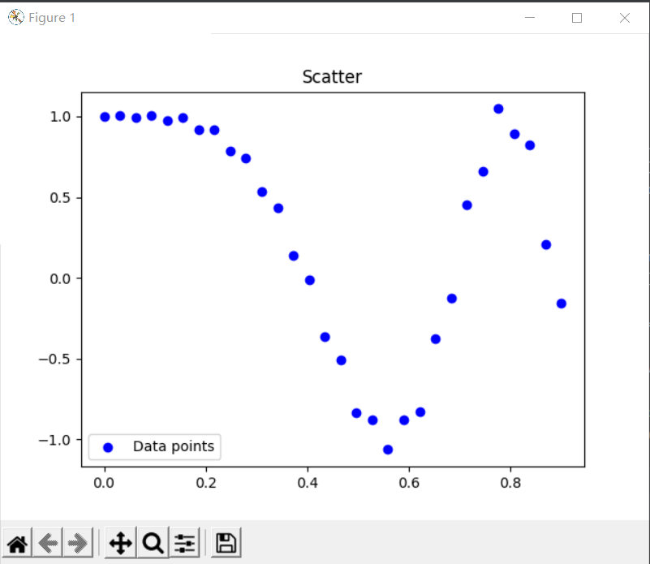
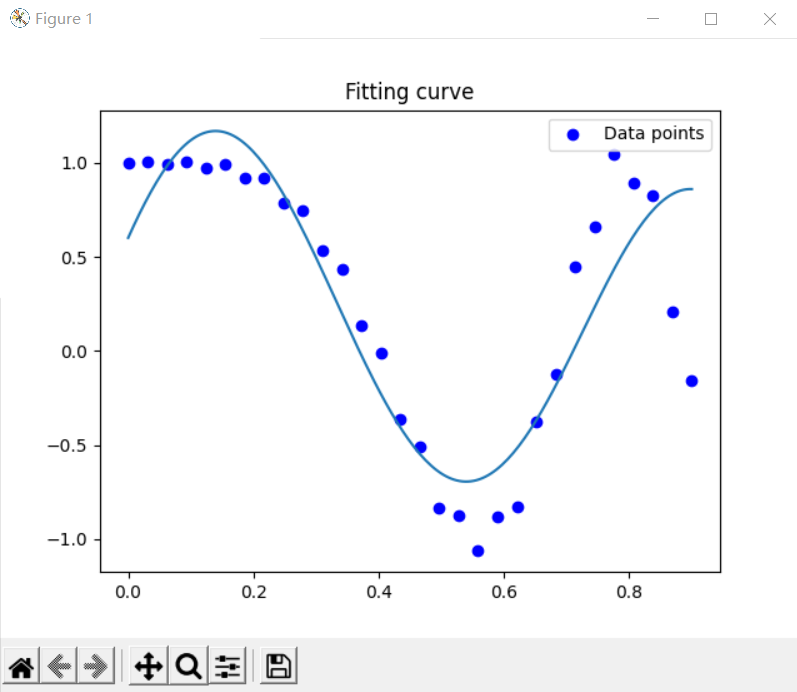

20337263俞泽斌

本次实验主要实现的是基于最大似然估计的多元线性回归算法

首先是关于数据点的选择

```python
x = np.reshape(np.linspace(0, 0.9, N), (N, 1))
y = np.cos(10 * x ** 2) + 0.1 * np.sin(100 * x)
```

是通过平均的思想在0~0.9中取出N个点，然后数据点的生成是通过三角函数来实现

这样我们能得到一副最初始的需要拟合的点图



然后是基于高斯分布下的矩阵的实现

高斯分布是我这里用来生成x矩阵的函数，即

```
g(x)=exp(-(x-ui)^2/2*theta)
```

所以为了得到跟拟合的曲线，我这里采用的数据点就比上图所示的数据点更多一点，取300个数据点并按照上述的三角函数来生成坐标作为线性回归的原始数据

因为是多元线性回归，所以我们需要学习的是一个w矩阵，令f(x,w)=g(x)*w和y的偏差最小

现在我们来生成g(x)矩阵

```python
def gaussian(x, mean, scale):
    gaussian_vec=np.array([np.exp(-(x - mu) ** 2 / (2 * scale ** 2)) for mu in mean])
    return np.array(np.append(np.ones(x.shape[0]),gaussian_vec).reshape(1 + len(mean), len(x)).T)
```

得到一个经过高斯函数处理后的矩阵，现在开始使用最大似然估计法

即令

```
argmax w np(y|x,w)
```

最小，那通过对数后求导可以得出（其实在课件里也有写）最后学习到的参数矩阵w为(X.T * y) /（X.T *X)

```
w = np.linalg.inv(fit_x.T @ fit_x) @ fit_x.T @ fit_y 
```

然后用这个学到的参数矩阵乘上我们原本的初始数据矩阵

```
fit_x @ w
```

就可以得到拟合的曲线如下



实验结束。