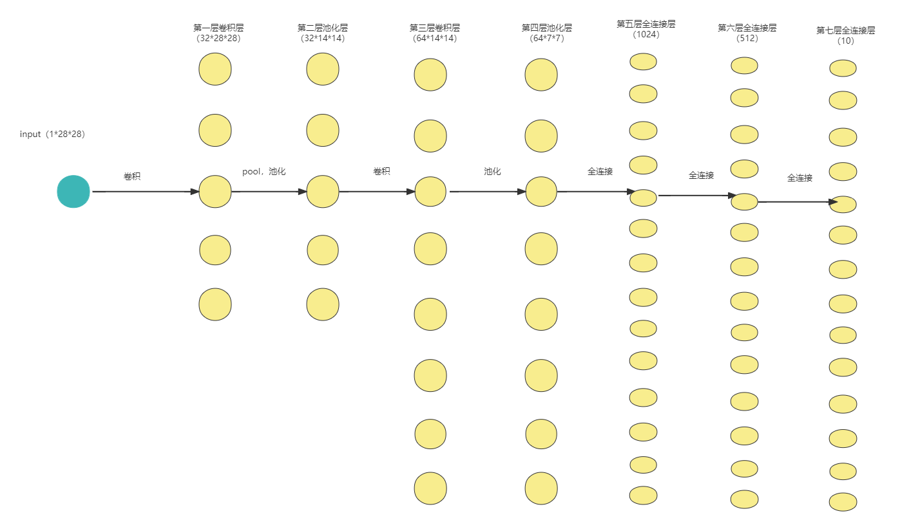
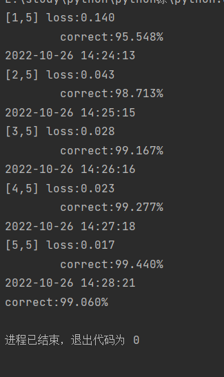
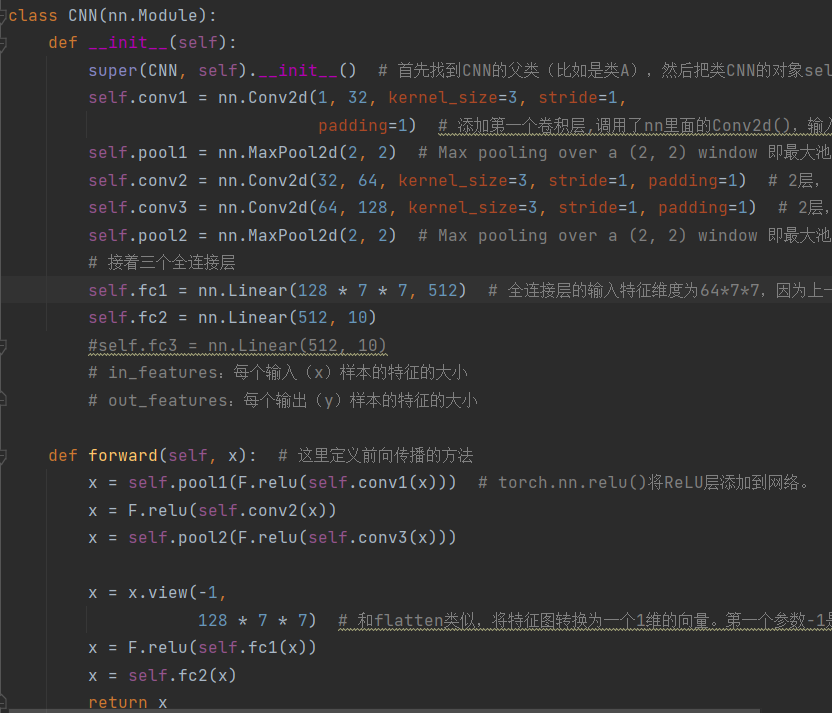
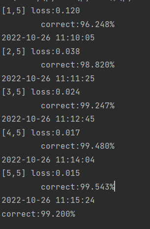
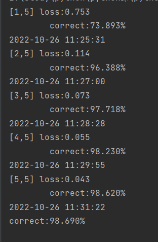
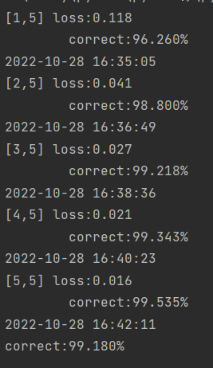
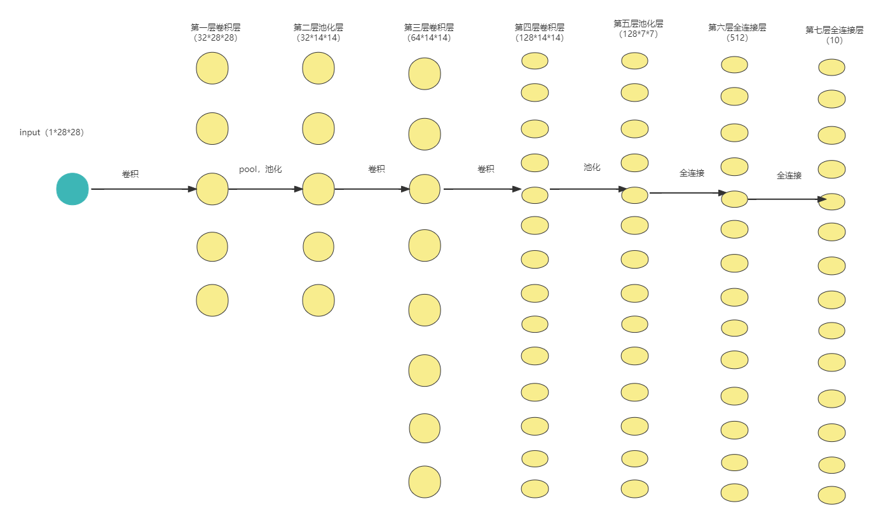

**人工智能实践**

**实验报告**

**（2022学年秋季学期）**

| 教学班级 | **计科2班**  | 专业（方向） | **计算机科学与技术** |
| -------- | ------------ | ------------ | -------------------- |
| 学号     | **20337263** | 姓名         | **俞泽斌**           |

# 一、   实验题目

1. 程序运行：运行 "深度学习-2-AI-CNN-test-whj.py"（如电脑较慢超过1小时得不到结果可以不运行此程序） 或 "深度学习-1-AI-FFN-test-whj.py"。

2. 程序修改（修改内容）：修改神经网络的参数如层数或大小或激活函数等、损失函数、或优化器、学习率等各种超参数乃至网络结构等，运行程序。

3. 记录结果：获得程序运行的结果，记录。GOTO 2，注意：采用与上次不同的修改内容。 在记录两次以上的不同修改结果后，可以进行第4步。
4. 撰写报告：选取最好的结果，画出该结果对应的网络结构（包括各层神经元种类、尺寸等)，并给出对比分析。

# 二、   实验内容

#### 1、程序运行

首先我们来看一下助教的代码，主体上可以修改的地方集中在CNN函数中

```python
class CNN(nn.Module):
    def __init__(self):
        super(CNN, self).__init__()  # 首先找到CNN的父类（比如是类A），然后把类CNN的对象self转换为类A的对象，然后“被转换”的类A对象调用自己的__init__函数
        self.conv1 = nn.Conv2d(1, 32, kernel_size=3, stride=1,
                               padding=1)  # 添加第一个卷积层,调用了nn里面的Conv2d()，输入的灰度图，所以 in_channels=1, out_channels=32 说明使用了32个滤波器/卷积核
        self.pool1 = nn.MaxPool2d(2, 2)  # Max pooling over a (2, 2) window 即最大池化层
        self.conv2 = nn.Conv2d(32, 64, kernel_size=3, stride=1, padding=1)  # 2层， 输入通道in_channels 要等于上一层的 out_channels
        self.pool2 = nn.MaxPool2d(2, 2)  # Max pooling over a (2, 2) window 即最大池化层

        # 接着三个全连接层
        self.fc1 = nn.Linear(64 * 7 * 7, 1024)  # 全连接层的输入特征维度为64*7*7，因为上一层Conv2d的out_channels=64，两个池化，所以是7*7而不是14*14
        self.fc2 = nn.Linear(1024, 512)
        self.fc3 = nn.Linear(512, 10)
        # in_features：每个输入（x）样本的特征的大小
        # out_features：每个输出（y）样本的特征的大小

    def forward(self, x):  # 这里定义前向传播的方法
        x = self.pool1(F.relu(self.conv1(x)))  # torch.nn.relu()将ReLU层添加到网络。
        x = self.pool2(F.relu(self.conv2(x)))
        x = x.view(-1,
                   64 * 7 * 7)  # 和flatten类似，将特征图转换为一个1维的向量。第一个参数-1是说这个参数由另一个参数确定， 比如：矩阵在元素总数一定的情况下，确定列数就能确定行数。第一个全连接层的首参数是64*7*7，所以要保证能够相乘，在矩阵乘法之前就要把x调到正确的size
        x = F.relu(self.fc1(x))
        x = F.relu(self.fc2(x))
        x = self.fc3(x)
        return x
```

代码中建立一个CNN网络，主要由两个卷积层，两个池化层和三个全连接层组成，其中的每个神经元的激活函数采用的时候relu函数，所以可以修改卷积层和池化层及全连接层的数目，当然也可以修改其中的网络的大小，比如将卷积层的size设置的更大，只需要保证每一层之间的输出大小都是下一层的输入即可

现在给出助教代码的神经网络结构图

因为数据维度确实有点大，所以点的个数和连接线个数都是简略的



可以看到这个CNN网络，主要由两个卷积层，两个池化层和三个全连接层组成，具体连接方式如图，然后进行一次运行



可以看到正确率其实已经很高了，并且随着每一次对训练集数据的输入和对CNN网络的训练，预测正确率不断提高，同时loss也不断减少，最后在样本集中得到的预测结果也正确率很高

下面对于该网络的参数做一些修改来寻找有无更好的参数选择

#### 2、程序修改（修改内容），记录结果

第一次修改：改变网络结构

将网络结构改成3层的卷积神经网络加上两层的全连接神经网络，改变代码如图



网络主要由三个卷积层，第一个卷积层和第二个卷积层，第三个卷积层和全连接层中间有两层的池化层，然后连接上两个全连接层组成

运行结果



可以看到这一次的运行结果是优于最初结果的，保留代码等待之后对比

第二次修改：改变神经元激活函数

可以发现助教代码中的神经元激活函数采用的都是relu函数，那我将神经元的激活函数改为softplus函数来看具体 运行结果



可以看到此时的运行结果比起上面两种稍微差了一点，所以不予考虑

第三次修改：改变学习率

最初代码中给的学习率是默认的1e-3

```python
optimizer = torch.optim.Adam(model.parameters()) #默认学习率1e-3。
```

在里面添加参数，使得学习率调整为0.005

```python
optimizer = torch.optim.Adam(model.parameters(),lr=0.005) 
```


运行结果


结果稍差，可能是学习过高，过拟合了，导致错过最优解

第四次修改: 改变网络大小

我在这里将两个卷积神经网络的大小做了一些调整，主要是将第一个卷积神经网络的输出大小改为64，第二个卷积神经网络的输入大小改成64，输出大小改成128，就是将两个卷积神经网络做了增大操作



结果也还可以，但是可能是网络结构有点大的缘故，运行时间稍微比起其他的长了一些


#### 3、撰写报告：选取最好的结果，画出该结果对应的网络结构（包括各层神经元种类、尺寸等)，并给出对比分析。

由上述结果，我选择的是第二次修改的结果，就是将网络结构进行改变，采用了三层卷积层两层全连接层

具体网络结构如图



神经元的激活函数全部为relu函数，优化器的学习率为默认的0.001，具体尺寸都标在图上了

与最初的代码进行比较，主要的区别也就是把其中的一层全连接层改成了卷积层，所以其实总体的正确率有差距但不是很大，卷积网络的优势可能在于可以再加很多层，而全连接网络加上很多层之后就会变得很慢很慢，因为连接的条数不同

修改前


修改后


至于对于第二三四种修改

第二种修改是改变神经元的激活函数，改成softplus函数，可能在本题环境下不太适用，relu计算速度快得多，而且当输入为正的时候，不存在梯度饱和问题

第三种修改是改变网络的学习率，改成0.05，可能导致对于参数的更新有点过度了，导致神经网络变化过快而错过了最优的情况

第四种修改增大卷积神经网络大小，正确率大小有所增加，但是网络大小所带来的运行时间成本也有所增加
