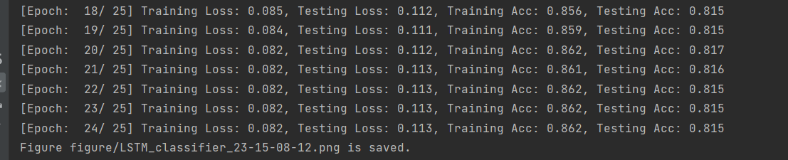
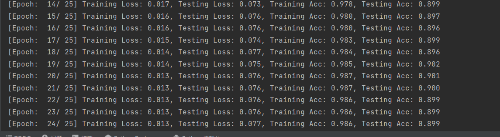

**人工智能实践**

**实验报告**

**（2022学年秋季学期）**

| 教学班级 | **计科2班**  | 专业（方向） | **计算机科学与技术** |
| -------- | ------------ | ------------ | -------------------- |
| 学号     | **20337263** | 姓名         | **俞泽斌**           |

# 一、   实验题目

运行LSTM和TRANSFORMER新闻分类程序（源程序请在课程群下载），并对比实验结果。以下选作：尝试修改程序（如增加TRANSFORMER深度，修改网络中的残差定义、修改激活函数、修改超参数等），并对比修改后与修改前的结果。  

# 二、   实验内容

#### 1、程序运行

##### LSTM：

执行后得到结果为下图


具体的正确率




只截取了其中的一部分数据，当然我们也能通过曲线很清晰地看出来loss的递减以及正确率的提高，说明整个LSTM在不断迭代向最优值接近

##### Transformer：

执行后得到结果为下图


具体的正确率




只截取了其中的一部分数据，当然我们也能通过曲线很清晰地看出来loss的递减以及正确率的提高，说明整个transformer在不断迭代向最优值接近

与之前的LSTM进行对比，可以明显地发现transformer所得到的的初值更好，并且收敛速度相对较快，在第14次时已经基本处于收敛状态，只有一些微小的调整，而LSTM得到的loss就比较高，收敛速度相对较慢，最后的正确率也比transformer小一点，同时因为训练有一定的误差存在，所以在最后的几次训练中存在acc偶然出现降低的情况也在合理范围内，但都是不断优化 的过程

#### 2、程序修改

##### LSTM：

（1）维度修改：

将初始维度改为128，隐藏层维度改为64

```python
    embedding_dim = 128  #token转换的维度，把token映射成96维度的向量。embedding layer
    hidden_dim = 64  #隐藏状态的维度
    sentence_len = 32 #多于32就截断，少于32就补0
```

执行结果


与上面最初的LSTM进行比较，可以看到此时的收敛速度变快，同时最后的结果也更好，具体体现在loss最终值更小以及正确率更高

但是由于维度地增加，会导致其中的计算复杂度增加，所以跑出这个结果所需要的时间更多

（2）激活函数修改

将原来输入门以及遗忘门的sigmoid激活函数改为relu

```python
        for t in range(seq_sz):     # 将序列依次放入LSTM单元中
            x_t = x[:, t, :]
            # @ 为矩阵运算
            i_t = torch.relu(x_t @ self.W_i + h_t @ self.U_i + self.b_i)
            #i_t = torch.sigmoid(x_t @ self.W_i + h_t @ self.U_i + self.b_i)     # 输入门，调整输入的x_t及h_t比例  𝑖_𝑡 = 𝜎(𝑊_𝑖 𝑥_𝑡+𝑈_𝑖 ℎ_(𝑡−1)+𝑏_𝑖)
            f_t = torch.relu(x_t @ self.W_f + h_t @ self.U_f + self.b_f)
            #f_t = torch.sigmoid(x_t @ self.W_f + h_t @ self.U_f + self.b_f)     # 遗忘门，以往上一次的 𝑓_𝑡 = 𝜎(𝑊_𝑓 𝑥_𝑡+𝑈_𝑓 ℎ_(𝑡−1)+𝑏_𝑓 )
            g_t = torch.tanh(x_t @ self.W_c + h_t @ self.U_c + self.b_c)        # 补给记忆,中间结果 c ̃_t = tanh(𝑊_𝑐 𝑥_𝑡+𝑈_𝑐 ℎ_(𝑡−1)+𝑏_𝑐) 
            o_t = torch.sigmoid(x_t @ self.W_o + h_t @ self.U_o + self.b_o)     # 输出门，用于生成输出
            c_t = f_t * c_t + i_t * g_t     # 计算下一个cell state， 记忆状态c_t+1  𝑐_𝑡 = 𝑓_𝑡⊙𝑐_(𝑡−1)+𝑖_𝑡⊙𝑐 ̃_𝑡 \\ c ̃_t = tanh(𝑊_𝑐 𝑥_𝑡+𝑈_𝑐 ℎ_(𝑡−1)+𝑏_𝑐) 
            h_t = o_t * torch.tanh(c_t)     # 计算下一个隐藏状态, h_t+1  ℎ_𝑡=𝑜_𝑡⊙tanh⁡(𝑐_𝑡)

```


这个修改过后通过曲线我们也能看出来，曲线的收敛速度变慢了，通过具体数据，我们可以看到最后的loss在0.11左右，比原来未经修改的数据差了很多，正确率方面也比较差，收敛速度慢，具体可能是relu函数在第一象限内取值可能越来越大，导致最后的训练数据存在较大的偏差，也就是训练会被影响很大

##### Transformer：

（1）维度修改：

跟LSTM操作一样，这里采取的也是将初始维度改为128，隐藏层维度改为64

```python
	embedding_dim = 128  #token转换的维度，把token映射成96维度的向量。embedding layer
    hidden_dim = 64  #隐藏状态的维度
    sentence_len = 32 #多于32就截断，少于32就补0
```


与上面最初的Transformer进行比较，可以看到此时的收敛速度随迭代次数的增加而变快，最后的结果也更好，具体体现在loss最终值更小以及正确率更高但是由于维度地增加，会导致其中的计算复杂度增加，所以跑出这个结果所需要的时间更多。

其实正确率的提高只有一点点，loss的降低倒是挺明显，同时从曲线上来看的收敛速率变快


